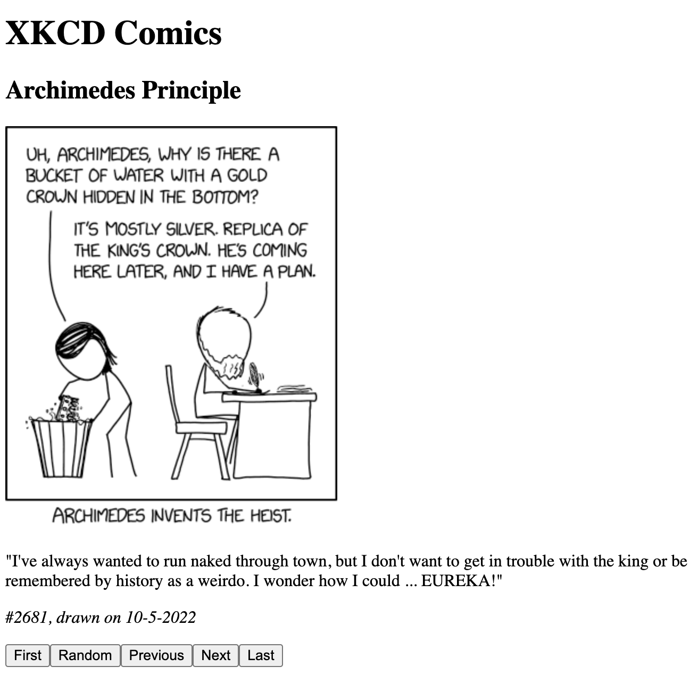

# Lab 3: Creating a React XKCD Browser

In this assignment, you will use React to build an application that uses
an API to browse XKCD comics.

## Starting the lab

To start the lab, you must follow this [GitHub Classroom
link](https://classroom.github.com/a/08IpOuzs). This will create a
private repository for you using our classroom site. We will only
grade repositories created and submitted this way.

Once you "Accept the assignment" on GitHub Classroom, it will create a
new repository for you and grant you access to it on GitHub. In order
to start working on the lab, simply clone the repository to your
Cloud9 environment.

## Tutorial

Use the [tutorial](/TUTORIAL.md)
to create the application. This will help you create most
of the functionality. Once you are done, your lab should look like this:

## Additional Functionality

Once you complete the tutorial, add the following functionality:

### More navigation buttons

Add buttons to navigate to the first comic and the last comic.

### Date and time for comments

Add the current date and time to every comment that is created, then
show the current date and time after or below the author's name. You may want to use the [moment](https://momentjs.com/) to  help you format the date and time.

## Link to GitHub repository

In a footer, you must include a link to your GitHub repository, which must be
stored in GitHub Classroom.

## Submission

On Canvas, submit the URL for your website, which should be running on
your server.

## Rubric for Grading

When we grade these labs, we will award points using the following
rubric:

Item | Points
--- | ---
The material in the tutorial works | 70
Buttons for first random and last comic work | 20
Date and time for comments work | 10
